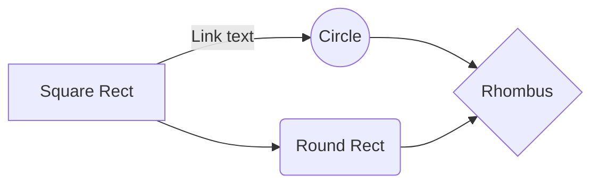

# clicky!
Have you ever wanted to take that extra 3 minutes in the shower, but couldn't because you needed to login into goodi and order a grocery voucher for this weeks groceries otherwise your children would starve and would be all your fault?

Or have you ever had to skip your morning coffee because you had to login into goodi and order a grocery voucher for this weeks groceries otherwise your children would starve and would be all your fault?

Maybe you just wanted to spend a little extra time to call grandma but couldn't because you had to login into goodi and order a grocery voucher for this weeks groceries otherwise your children would starve and would be all your fault?

Rejoice! You need not worry about starving your children for clicky is here.

Also remember use this at your own risk that we aren't responsible for any bugs and stuff...think about the children.

# Getting started

 - Make sure that you have [node](https://nodejs.org/en/) installed on your pc.
 - If you don't have node installed find a nerd who will do it for you.
 - Download or clone clicky.
	 - If you downloaded clicky, move it somewhere safe and unzip it.
	 - If you cloned clicky, well done nerd.
 - Go to the directory you unzipped clicky and create a dotenv (.env) file 
	 - See below for dotenv parameters
 - Open a [terminal](https://www.ionos.com/help/email/troubleshooting-mail-basicmail-business/access-the-command-prompt-or-terminal/#:~:text=Open%20Command%20Prompt%20in%20Windows,cmd%22%20and%20then%20click%20OK.)
 - Go to the safe directory where you installed copied clicky
	 - If it's your first time running clicky type npm install then click enter
	 - Otherwise type  npx nightwatch clicky.js then click enter
 - **Good luck!**


## Usage

Add your app configuration in an **.env**  see below for props and example.

### .env Props

| Prop | Description |
| --- | --- |
| `GOODI_USER` | The username you use to sign into goodi |
| `GOODI_PASS` | The password you use to sign into goodi |
| `MAX_AMOUNT` | The maximum value of the voucher|
| `SUPERMARKETS` | Which supermarkets currently supports RAMI,SHUFERSAL,VICTORY|
| `BROWSER_NAME` | Browser supports firefox or chrome |
| `showLineNumbers?` | Whether to show line numbers next to each line. |
| `readOnly?` | Make the editor read only. |
| `autoFocus?` | Focus the code editor on component mount. |

### .env Example
```
GOODI_USER=USER_NAME_HERE
GOODI_PASS=PASSWORD_HERE
MAX_AMOUNT=60
SUPERMARKETS=RAMI,SHUFERSAL,VICTORY
BROWSER_NAME=firefox
```

## Happy thursday and good luck
I kept this because it looked cool:


